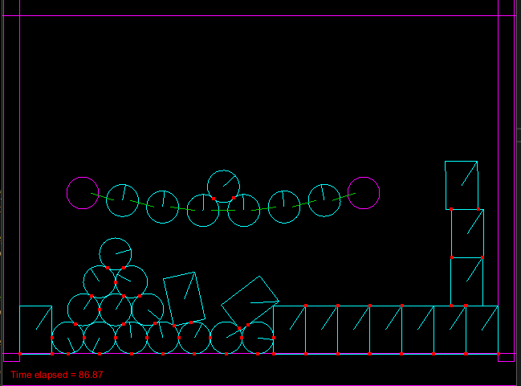

# Phx

This is my high school project involving creating basic 2D physics engine with graphical presentation.
Collision resolving is based on impulse method.

## Features
- Materials
- Gravity
- Friction
- Resolving collision
- Basic shapes: circle, convex polygon
- Complex shapes combined from basic ones (*almost working*)
- Distance joints
- Graphical testbed

## Usage
- Run Visual Studio project and compile it
- Run exe in build folder
- Left mouse button adds circles, right adds boxes
- **G** key is switching gravity
- **F** key is switching friction 
- **V** key adds ball bridge
- **P** key switches debug draw(with visible contact points) 
